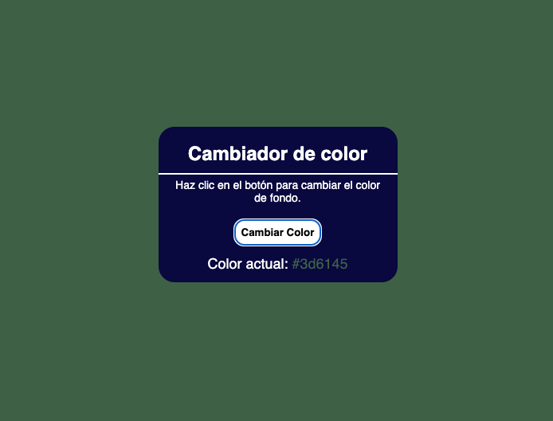

# Cambiador de Color 🎨

Este es un pequeño proyecto web hecho con **HTML**, **CSS** y **JavaScript** que permite cambiar el color de fondo de la página de forma aleatoria al hacer clic en un botón.

## 🖼️ Vista previa



## 🚀 Funcionalidad

- Muestra un cuadro con un título y un botón.
- Al hacer clic en el botón **"Cambiar Color"**, el color de fondo de la página cambia aleatoriamente.
- Se muestra en tiempo real el color actual en formato hexadecimal.

## 🛠️ Tecnologías utilizadas

- HTML
- CSS
- JavaScript

## 📁 Estructura del proyecto

```
/cambiador-color
│
├── index.html
├── style.css
├── script.js
└── Captura de Pantalla 2025-06-27 a la(s) 11.52.12.png
```

## 📸 Captura

La imagen muestra el diseño visual del proyecto, con el cuadro flotante centrado, fondo oscuro y botón resaltado.

## 📌 Cómo usarlo

1. Clona este repositorio:

```bash
git clone https://github.com/tu-usuario/cambiador-color.git
```

2. Abre el archivo `index.html` en tu navegador.

3. Haz clic en el botón para cambiar el color de fondo.

---

¡Este proyecto es ideal para practicar manejo de eventos, manipulación del DOM y estilos dinámicos!

## 📄 Licencia

Este proyecto se puede usar libremente con fines educativos.
